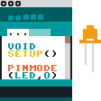
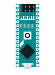
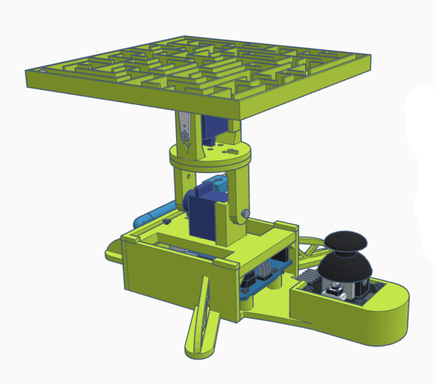
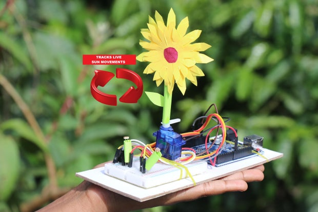

Welcome to the `FabLab Hands-on Open House - Arduino Edition` :wave:

This event is for new students of 42 Berlin to get to the know the FabLab and especially the 'clean lab'.

# The goal

Build an Arduino project together which involves electronics, code and some fabrication!

And learn about:
- the different types of Arduino, components and sensors we have the lab and how to use them
- how to upload code to an Arduino using the Arduino IDE
- how to simulate Arduino-based circuits and code using Tinkercad
- how to use a breadboard
- ...and much more!

# The repo

Start here: https://github.com/fablabnk/OpenHouse_ArduinoEdition

# The projects

1. Arduino Maze Robot

2. Rock-Paper-Scissors Robot

3. Sun Tracking Sunflower Robot

# Next steps

If you enjoy this session:
- come on any FabLab Friday between 2 and 6pm to continue your project
- watch out for the upcoming Microcontroller Makerthon taking place over a weekend in the lab!